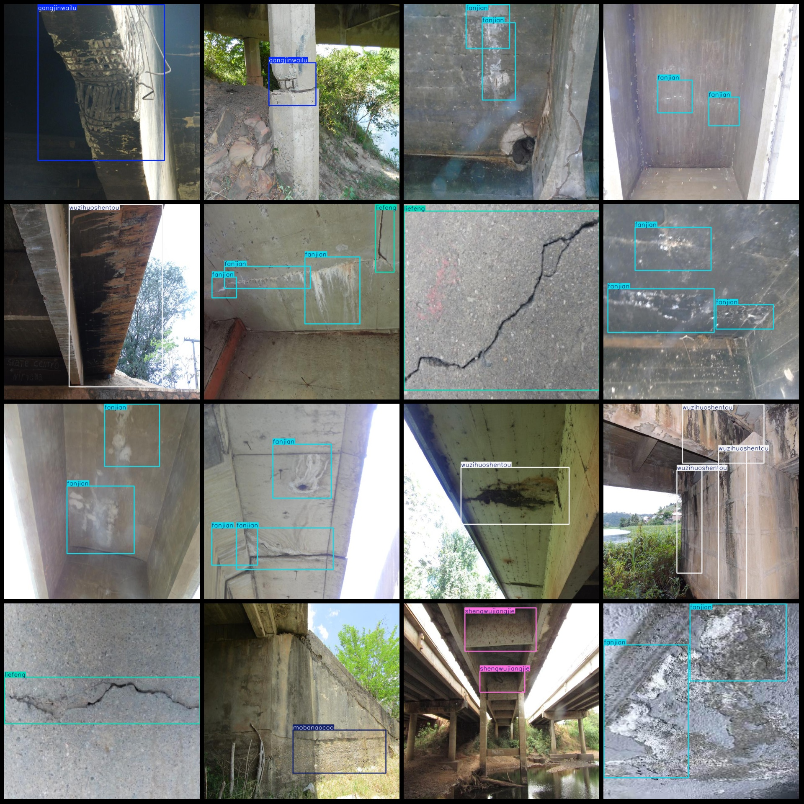
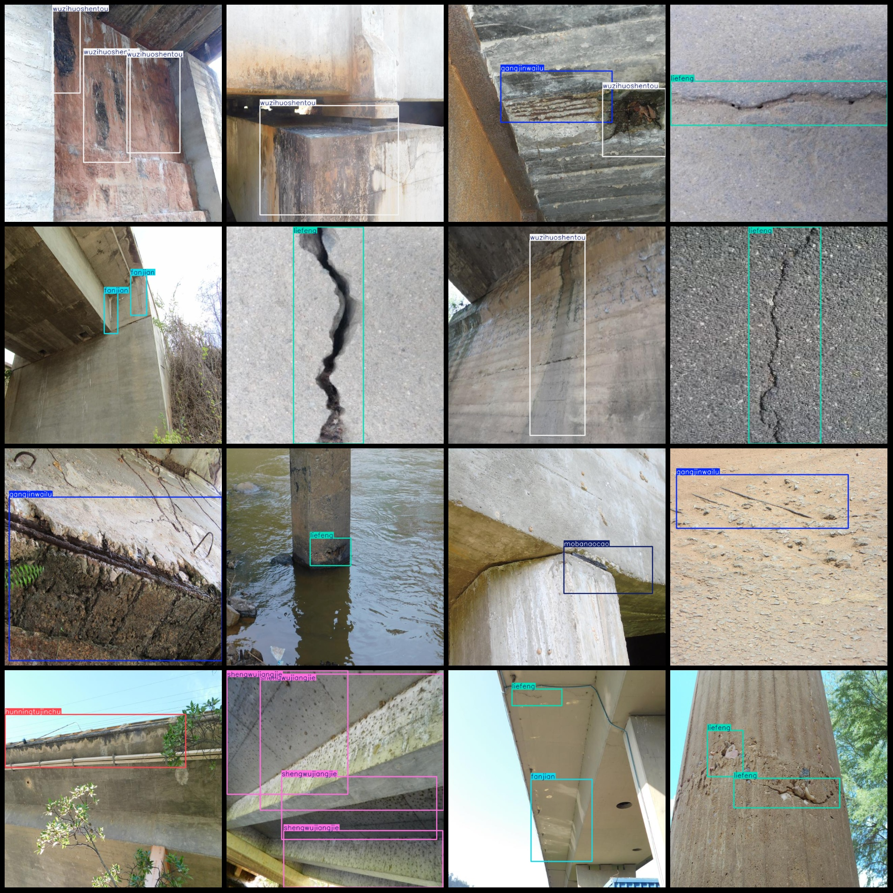

# Intelligent Bridge Defect Inspection, Cracks, Chlorides, Detection Data Set in VOC+YOLO Format with 7 Categories

Dataset format: Pascal VOC format + YOLO format (excluding split paths, only txt files containing jpg images along with their corresponding VOC and YOLO format xml files)
Number of images (jpg file count): 7925
Number of annotations (xml file count): 7925
Number of annotations (txt file count): 7925
Number of annotation categories: 7
Annotation category names (Note that the order in the yolo format is not consistent with this, but follows the labels folder classes.txt): ["fanjian", "gangjinwailu", "hunningtujinchu", "liefeng", "mobanaocao", "shengwujiangjie", "wuzihuoshentou"]
[ "Sulphate Exposure", "Bare Rebar", "Cracking", "Dilution of Concrete", "Cavity in Formwork", "Biodegradation", "Dirt or Penetration"]
Number of boxes for each category:
fanjian boxes = 3538
gangjinwailu boxes = 2389
hunningtujinchu boxes = 2630
liefeng boxes = 3419
mobanaocao boxes = 1345
shengwujiangjie boxes = 1434
wuzihuoshentou boxes = 2243
Total number of frames: 16998
Number of images per category:
fanjian images = 1468
gangjinwailu images = 1354
hunningtujinchu images = 1262
liefeng images = 1799
mobanaocao images = 862
shengwujiangjie images = 931
wuzihuoshentou images = 1273
Image resolution: 640x640
Labeling tool used: labelImg
Labeling rules: Draw a rectangle around the category.
Special note: The dataset does not have separate training, validation, or test sets; you need to partition them yourself.
Special declaration: This dataset does not guarantee the accuracy of the trained model or weight files.
Image preview:
## Images

Here is a pay link on Stripe ( https://buy.stripe.com/3cs8yP7sY87d0vu9AB ). Please contact me lonlonago@foxmail.com after funding $89, and I will send you a complete data files , thank you!

